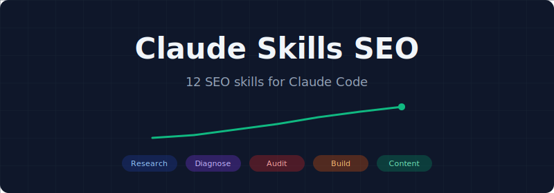
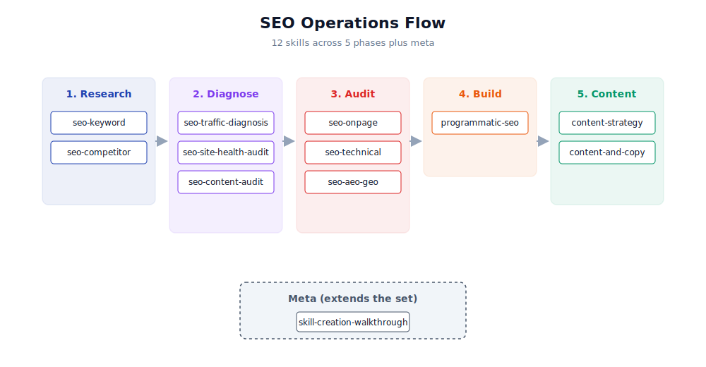

<p align="center">
  
</p>

# Claude Skills SEO

[](#whats-included)
[](LICENSE)

A focused 12-skill SEO subset of [claude-skills](https://github.com/rampstackco/claude-skills). Designed for SEO consultants, freelancers, and in-house teams who want SEO depth in Claude Code without loading the full 99-skill catalog.

## Why an SEO-focused subset

The full claude-skills catalog has 15 SEO skills. Four require Ahrefs MCP setup, which is overhead for anyone just starting with Claude Code for SEO work. The remaining 11 standalone SEO skills plus a few content and meta skills cover the everyday SEO workflow.

This repo answers the practical question: "which SEO skills should I load in Claude Code?" Load these 12 and your sessions are focused on SEO operations without scrolling past unrelated tools.

When you need the Ahrefs-integrated workflows (backlink audits, rank tracking, gap analysis, orchestrated audits), reach for the full catalog.

## SEO operations flow

<p align="center">
  
</p>

The 12 skills map to a 5-phase SEO operations flow, plus a meta skill for extending the set. Skills within a phase are designed to work together; phases flow into each other but you can enter the workflow at any phase based on the engagement.

## What's included

### SEO core (9)

| Skill | Purpose |
|---|---|
| seo-keyword | Keyword research, intent classification, topical clustering |
| seo-onpage | On-page audit: titles, meta, headers, internal links |
| seo-technical | Technical audit: crawlability, indexability, rendering, schema |
| seo-aeo-geo | Optimize for AI search (AI overviews, LLM citations) |
| seo-traffic-diagnosis | Diagnose organic traffic drops, stalls, wins |
| seo-site-health-audit | Triage technical findings by SEO impact |
| seo-competitor | Competitive SEO analysis vs. chosen competitors |
| seo-content-audit | Decide what content to keep, update, merge, redirect, delete |
| programmatic-seo | Design and run a programmatic SEO program |

### Content companion (2)

SEO is inseparable from content. Two skills cover the content side without dragging in a full content stack:

| Skill | Purpose |
|---|---|
| content-strategy | Anchor for content work that supports SEO |
| content-and-copy | Writing and editing copy alongside SEO recommendations |

### Skill authoring (1)

| Skill | Purpose |
|---|---|
| skill-creation-walkthrough | Create new skills to extend the set yourself |

## Installation

Clone this repository into your Claude Code skills directory, or fork it and customize.

```bash
git clone https://github.com/rampstackco/claude-skills-seo.git
```

Then point Claude Code at the `skills/` directory according to your harness's configuration.

## When to use the full catalog instead

Reach for the full [claude-skills](https://github.com/rampstackco/claude-skills) catalog if you need:

- **Ahrefs MCP-dependent workflows**: backlink audits, rank tracking, content gap audits, the orchestrated full-audit suite
- **Off-page work**: digital PR, link building, citations, authority signals
- **Specialized SEO depth**: keyword gap analysis with deeper data integration
- **Cross-discipline work**: brand, design, paid media, analytics, product management

The full catalog covers 15 SEO skills total plus 84 skills across content, brand, design, conversion, paid media, analytics, PM, and dev.

## Family repos

This catalog is part of the Claude Skills family. Other family repos:

| Repo | Focus | Skills |
|---|---|---|
| [claude-skills](https://github.com/rampstackco/claude-skills) | Full catalog | 99 |
| [claude-skills-starter](https://github.com/rampstackco/claude-skills-starter) | General-purpose lite | 14 |
| [claude-skills-pm](https://github.com/rampstackco/claude-skills-pm) | Product management | 12 |
| [claude-skills-widgets](https://github.com/rampstackco/claude-skills-widgets) | UI patterns + components | 65 + 32 |
| [awesome-claude-skills](https://github.com/rampstackco/awesome-claude-skills) | Curated discovery list | n/a |

Each family repo is MIT-licensed, conforms to the [Agent Skills Specification](https://agentskills.io), and is stack-agnostic. Use the full catalog for breadth; use a specialty subset when working in one domain.

## Pairing patterns

| Working on | Load this combo |
|---|---|
| Pure SEO consulting | claude-skills-seo |
| SEO + landing page builds | claude-skills-seo + claude-skills-widgets |
| Full-stack marketing | claude-skills (full catalog) |
| General Claude Code | claude-skills-starter |

## Contributing

This repository is curated rather than open to broad contribution. The skill list is deliberately focused on SEO and adjacent content work. Skill content changes should be made to the source repository at [claude-skills](https://github.com/rampstackco/claude-skills); changes accepted there can be re-synced here.

If you spot an issue with how the SEO subset has copied or referenced a skill, or you want to propose a different SEO skill cut, open an issue or start a discussion.

## License

MIT. Use freely in commercial and non-commercial projects.
